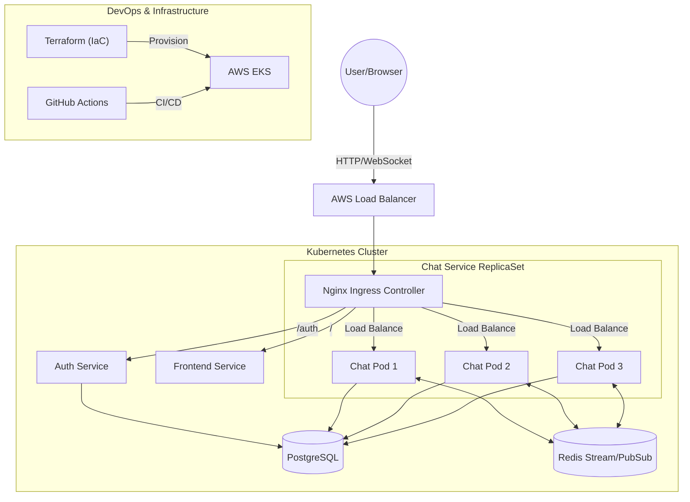

# 🚖 K8s Microservices Ride-Sharing Platform

A cloud-native, real-time ride-sharing application built with **Golang Microservices**, **React**, and **Kubernetes**. This project demonstrates a full-stack implementation of a distributed system, featuring real-time chat, role-based access, and automated CI/CD pipelines to AWS.

## 🏗 System Architecture

The system follows a microservices architecture pattern running on Kubernetes.



### Key Components
*   **API Gateway (Nginx Ingress):** Handles routing, CORS, and load balancing for all services.
*   **Frontend (React + Vite):** A responsive SPA handling user interactions, utilizing relative paths to communicate with backend services through the gateway.
*   **Auth Service (Go):** Handles Google OAuth 2.0 authentication, issuing service-scoped JWTs, and syncing user data to PostgreSQL (Upsert logic).
*   **Chat/Ride Service (Go):** Manages ride creation, joining logic, and real-time chat using **WebSocket** and **Redis Pub/Sub** for broadcasting messages across replicas.
*   **Data Persistence:**
    *   **PostgreSQL:** Stores user profiles, ride details, and permanent chat history.
    *   **Redis:** Handles real-time message streams (hot data) and Pub/Sub channels.

---

## ✨ Key Features

*   **Authentication:** Secure login via **Google OAuth 2.0**, exchanging Google credentials for internal JWTs.
*   **Role Switching:** Seamlessly switch between **Driver** (create rides) and **Passenger** (join rides) modes.
*   **Ride Management:** Drivers can schedule rides (origin, destination, time, capacity); Passengers can browse and join available rides.
*   **Real-time Chat:** Instant messaging within a ride group using WebSockets.
*   **Dashboard:** A calendar view to track upcoming scheduled rides.
*   **Data Persistence:** Chat history and ride data are persisted in PostgreSQL.

---

## 🛠 Tech Stack

| Category | Technology |
|----------|------------|
| **Frontend** | React, TypeScript, Vite, Tailwind CSS, React Router |
| **Backend** | Golang, Gorilla WebSocket, Go-Redis, JWT |
| **Database** | PostgreSQL, Redis |
| **Infrastructure** | Kubernetes (K8s), Docker, AWS EKS |
| **DevOps** | Terraform (IaC), GitHub Actions (CI/CD), Tilt (Local Dev) |
| **Gateway** | Nginx Ingress Controller |

---

## 🚀 Getting Started (Local Development)

This project uses **Tilt** and **Kind** (Kubernetes in Docker) for a seamless local development experience.

### Prerequisites
*   **Docker** & **Kind** installed.
*   **Tilt** installed.
*   **Kubectl** installed.
*   **Go** (1.22+) & **Node.js** (20+).

### Installation Steps

1.  **Clone the repository**
    ```bash
    git clone https://github.com/your-username/k8s-ride-sharing.git
    cd k8s-ride-sharing
    ```

2.  **Create a Local Cluster**
    ```bash
    kind create cluster --name my-chat
    ```

3.  **Setup Secrets (Important)**
    Create a `deploy/k8s/secret.yaml` file (this is git-ignored for security):
    ```yaml
    apiVersion: v1
    kind: Secret
    metadata:
      name: app-secret
    type: Opaque
    stringData:
      POSTGRES_PASSWORD: "password"
      JWT_SECRET: "your_local_secret_key"
      GOOGLE_CLIENT_SECRET: "your google client secret"
    ```

4.  **Configure Frontend Environment**
    Create `frontend/.env`:
    ```properties
    VITE_GOOGLE_CLIENT_ID=your_google_client_id.apps.googleusercontent.com
    # Leave VITE_API_URL empty for local Nginx proxying
    VITE_API_URL=
    ```

5.  **Start the Application**
    Run Tilt to spin up all services:
    ```bash
    tilt up
    ```
    *Tilt will build Docker images, deploy Nginx Ingress, Postgres, Redis, and your services automatically.*

6.  **Access the App**
    Open your browser and go to:
    👉 **http://localhost:8000**
    *(Note: We use port 8000 as the Nginx Gateway entry point)*

---

## ☁️ Cloud Deployment (AWS)

The project is designed to be "Cloud Agnostic" but currently optimized for **AWS EKS**.

### Infrastructure as Code (Terraform)
We use Terraform to provision the AWS infrastructure:
1.  **VPC & Networking:** Creates a dedicated VPC with public/private subnets.
2.  **EKS Cluster:** Provisions the Kubernetes control plane and worker nodes.

```bash
cd terraform
terraform init
terraform apply
```

### CI/CD Pipeline (GitHub Actions)
Deployment is fully automated via GitHub Actions