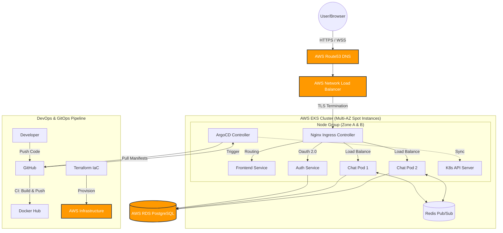

# 🚖 K8s Microservices Ride-Sharing Platform

**🌐 Live Deployment:** [https://neo1202-k8s-ride-sharing.com/](https://neo1202-k8s-ride-sharing.com/)

A cloud-native, real-time ride-sharing application built with **Golang Microservices**, **React**, and **Kubernetes**. This project demonstrates a full-stack implementation of a distributed system, featuring real-time chat, role-based access, GitOps automation, Multi-AZ high availability in AWS, and secure HTTPS communication.

## 🏗 System Architecture

The mircoservice infrastructure is designed for High Availability (HA) and Security, utilizing AWS managed services and Kubernetes orchestration.



### Key Components

- **API Gateway (Nginx Ingress):** Handles routing, CORS, and load balancing for all services.
- **Frontend (React + Vite):** A responsive SPA handling user interactions, utilizing relative paths to communicate with backend services through the gateway.
- **Auth Service (Go):** Handles Google OAuth 2.0 authentication, issuing service-scoped JWTs, and syncing user data to PostgreSQL (Upsert logic).
- **Chat/Ride Service (Go):** Manages ride creation, joining logic, and real-time chat using **WebSocket** and **Redis Pub/Sub** for broadcasting messages across replicas.
- **Data Persistence:**
  - **PostgreSQL:** Stores user profiles, ride details, and permanent chat history.
  - **Redis:** Handles real-time message streams (hot data) and Pub/Sub channels.

---

### 🏛 Architecture Highlights

- **Traffic Entry (DNS & SSL):**

  - **AWS Route53** manages the domain (`neo1202-k8s-ride-sharing.com`).
  - **AWS ACM** provides auto-renewing SSL certificates attached to the Load Balancer.
  - **AWS Network Load Balancer (NLB)** ensures high-performance TCP throughput for WebSocket connections.

- **Compute Layer (EKS Multi-AZ):**

  - Running on **AWS EKS** (v1.32+).
  - Nodes are provisioned as **Spot Instances** across multiple Availability Zones (Multi-AZ) for cost-efficiency and fault tolerance.
  - **Pod Anti-Affinity** ensures Chat Service replicas are distributed across different nodes.

- **Storage Layer (Separation of Compute & Storage):**

  - **AWS RDS (PostgreSQL):** A single, managed database instance provides persistent storage for User profiles and Ride data. It is decoupled from the K8s cluster for data safety.
  - **Redis (In-Cluster):** Handles ephemeral data for Pub/Sub real-time messaging.

- **GitOps Deployment:**
  - **ArgoCD** runs inside the cluster, automatically syncing Kubernetes state with the GitHub repository configuration.

---

## ✨ Key Features

- **Authentication:** Secure login via **Google OAuth 2.0**, exchanging Google credentials for internal service-scoped JWTs.
- **Role Switching:** Seamlessly switch between **Driver** (create rides) and **Passenger** (join rides) modes.
- **Ride Management:** Drivers can schedule rides (origin, destination, time, capacity); Passengers can browse and join available rides.
- **Real-time Chat:** Instant messaging within a ride group using WebSockets.
- **Dashboard:** A calendar view to track upcoming scheduled rides.
- **Data Persistence:** Chat history and ride data are persisted in PostgreSQL.
- **Cloud-Native Security:** Fully HTTPS encrypted traffic from client to Load Balancer.

---

## 🛠 Tech Stack

| Category           | Technology                                                                |
| ------------------ | ------------------------------------------------------------------------- |
| **Frontend**       | React, TypeScript, Vite, Tailwind CSS, React Router                       |
| **Backend**        | Golang, Gorilla WebSocket, Go-Redis, JWT                                  |
| **Database**       | **AWS RDS (PostgreSQL)**, Redis                                           |
| **Infrastructure** | **AWS EKS**, **AWS NLB**, **AWS Route53**, **AWS ACM**                    |
| **IaC & DevOps**   | **Terraform**, **ArgoCD (GitOps)**, GitHub Actions (CI), Tilt (Local Dev) |
| **Gateway**        | Nginx Ingress Controller                                                  |

---

## 🚀 Getting Started (Local Development)

Local development mocks the cloud environment using **Kind** and **Tilt**.

### Prerequisites

- **Docker** & **Kind** installed.
- **Tilt** installed.
- **Kubectl** installed.
- **Go** (1.22+) & **Node.js** (20+).

### Installation Steps

1.  **Clone the repository**

    ```bash
    git clone https://github.com/your-username/k8s-ride-sharing.git
    cd k8s-ride-sharing
    ```

2.  **Create a Local Cluster**

    ```bash
    kind create cluster --name my-chat
    ```

3.  **Setup Secrets (Important)**
    Create a `deploy/local-k8s/secret.yaml` file (this is git-ignored for security):

    ```yaml
    apiVersion: v1
    kind: Secret
    metadata:
      name: app-secret
    type: Opaque
    stringData:
      POSTGRES_PASSWORD: "password"
      JWT_SECRET: "your_local_secret_key"
    ```

4.  **Configure Frontend Environment**
    Create `frontend/.env`:

    ```properties
    VITE_GOOGLE_CLIENT_ID=your_google_client_id.apps.googleusercontent.com
    # Leave VITE_API_URL empty for local Nginx proxying
    VITE_API_URL=
    ```

5.  **Start the Application**
    Run Tilt to spin up all services:

    ```bash
    tilt up
    ```

    _Tilt will spin up a local Postgres Pod (mimicking RDS), Redis, and Nginx, and hot-reload your Go/React code._

6.  **Access the App**
    Open your browser and go to:
    👉 **http://localhost:8000**
    _(Note: We use port 8000 as the Nginx Gateway entry point)_

---

## ☁️ Cloud Deployment (GitOps Workflow)

The production environment is fully automated using **Terraform** and **ArgoCD**.

### 1. Infrastructure Provisioning (Terraform)

We use Terraform to build the entire AWS foundation:

- **VPC & Subnets:** Custom networking setup.
- **EKS Cluster:** With managed node groups (Spot Instances).
- **RDS Database:** Managed PostgreSQL instance.
- **Security Groups:** Firewall rules allowing EKS to talk to RDS.
- **ACM & Route53:** Auto-provisioning SSL certificates and DNS records.
- **Helm Releases:** Automatically installs Nginx Ingress, Reloader, and ArgoCD.

```bash
cd terraform
terraform init
terraform apply
```

### 2. Continuous Integration (GitHub Actions)

When code is pushed to the `main` branch:

1.  **Build:** Docker images are built for Auth, Chat, and Frontend services.
2.  **Push:** Images are pushed to **Docker Hub** with the `:latest` tag.
3.  **Trigger:** A command is sent to EKS to restart pods, pulling the new images.

### 3. Continuous Deployment (ArgoCD)

ArgoCD monitors the `deploy/k8s` directory in this repository.

- Any changes to Kubernetes manifests (YAML) are automatically applied to the cluster.
- Ensures the cluster state always matches the Git configuration (**Self-Healing**).
- **Access ArgoCD UI:** `https://neo1202-k8s-ride-sharing.com/argocd`

---

## 📂 Project Structure

```text
.
├── .github/workflows/   # CI Pipelines (Build & Push)
├── deploy/
│   ├── argocd.yaml      # ArgoCD Application Manifest
│   ├── k8s/             # Production Manifests (Synced by ArgoCD)
│   │   ├── ingress.yaml # Route rules ( /api, /auth, /ws )
│   │   └── ...
│   └── local-k8s/       # Local-only Manifests (Ignored by ArgoCD)
├── frontend/
├── services/
│   ├── auth/            # Go Auth Service
│   └── chat/            # Go Chat Service
├── terraform/           # Infrastructure as Code (AWS EKS + RDS)
└── Tiltfile             # Local Development Orchestration
```
